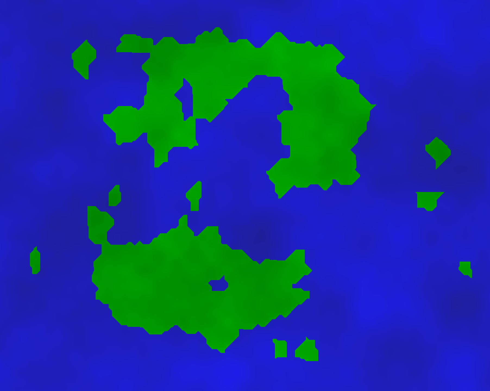

# Procedural Map Generation with Voronoi Tessellations

An engine for procedural generation of maps (for use in games, Dungeons & Dragons campaigns, etc.) written in Java using Voronoi tessellations.

### INSTRUCTIONS:
Click on the map to draw a rough shape;
press ENTER to generate the map.

## Requirements

[Processing 3.x](https://processing.org/download/)

## Development Process

### 1. Voronoi Tessellations

To start, what is a Voronoi tessellation? Essentially, it's a plane partitioned into regions based on any given point's closeness to a given set of objects. For the purposes of this project, I plotted points on the canvas, and generated Voronoi tessellations from those:

### 2. Generating Land

Now that we have our Voronoi diagram, we can select certain tiles from it to use as "land". Instead of just drawing, say, a regular circle, a Voronoi diagram introduces some irregularity on shape borders. This makes the map a bit more realistic.

For this sketch, I drew an imaginary circle in the center of the canvas. Then, any of the Voronoi tiles whose points fell within that circle counted as "land". Here's what that selection would look like:

### 3. Prettifying

We now have quasi-realistic borders for our imaginary island, but it doesn't look much like an island. We can fix that by drawing the land tiles in green:

One thing to note about this project is that I didn't generate the points for the Voronoi diagram entirely randomly. Instead, I drew them in an even grid, then agitated them slightly to add more variation. In fact, we can see how the "smoothness" of the island borders changes based on how fine the grid is! Here's an example where I drew points in an 8x8 grid, which is much rougher:

And here's what the map looks like with a 50x50 grid, which is much more granular:

### 4. Map Features

We can now add more variation and character to our maps. First, I introduced a bit of randomness so that some "land" tiles would be converted to water tiles (like lakes or ponds!) and some water tiles would be converted to tiny offshore islands. That gives us this result:

In the above examples, you can still see the distinct Voronoi cells somewhat since I mapped pixel colors to their distance from the closest point in the Voronoi array. I wanted to change this so that the textures would more closely resemble actual terrain. To quickly implement this feature, I used Perlin noise, which is a noise function built into Processing that is very useful for generating textures.

### 5. Manhattan Distance Calculation

I was still a little unhappy with the map shapes, so I looked into using Manhattan distance calculation rather than Euclidean for the Voronoi diagram. In short, this constrained all edges to 8 directions. This is what a raw Voronoi diagram looks like with Manhattan distance calculation:

The end result with this method looks a bit cleaner:

### 6. Interactivity

I wanted to give the user some control over the map that was generated. To do this, I let the user plot a certain number of points. These points would be used as a rough estimate for the shape of the island (i.e. which tiles would be selected as "land"). 

In the earlier example, I just drew a circle at the center of the map and set any points within that circle to be land. This new feature allows more variation with island shapes, since the "land" shape can be something other than a circle. This was the result:

### Future Improvements

One thing I think is lacking right now is more varied terrain. In a future iteration of the project (and given more time), I'd like to implement some kind of biome system so we could have sand on the shore lines, as well as tundras, jungles, or deserts.

Another nice addition would be to calculate the Voronoi diagram more efficiently. I recently learned a method to do this in my Algorithms class (closest pair in the plane) so it would be nice to implement this in the sketch.

More samples:

Learning resources:

[Voronoi Diagrams and Procedural Map Generation](https://www.youtube.com/watch?v=3G5d8ob_Lfo)

[Polygon Map Generation for Games](http://www-cs-students.stanford.edu/~amitp/game-programming/polygon-map-generation/)

[Worley Noise with Daniel Shiffman](https://www.youtube.com/watch?v=4066MndcyCk&t=28s)
